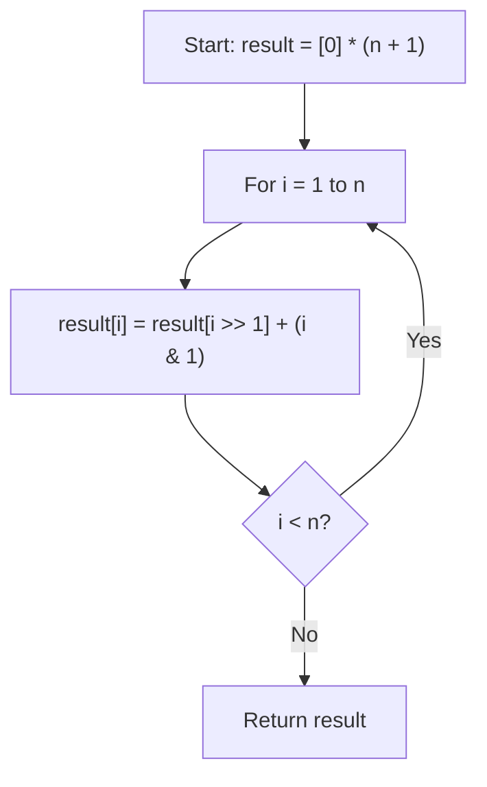

## Data Structures

* **`result: List[int]`** — an array of length `n + 1` where `result[i]` holds the number of `1`-bits in the binary representation of `i`.
* **`n: int`** — the upper bound of the range `[0, n]` for which we compute bit counts.

## Overall Approach

We use a **dynamic programming** recurrence based on the observation that the number of `1`-bits in `i` relates to `i >> 1` (i.e. `i` with its last bit removed). Shifting right by one gives a smaller number whose bit count we've already computed, and the only thing left to account for is whether `i`'s least-significant bit is `1`.

The recurrence is:

$$
\text{result}[i] = \text{result}[i \gg 1] + (i \mathbin{\&} 1)
$$

This replaces the naïve approach (shown commented out in the source) of counting bits individually for every number in $O(\log i)$ per number.



**Step-by-step walkthrough:**

1. Create an array of zeros with `n + 1` entries. `result[0] = 0` is the base case (zero has no set bits).

   ```python
   result = [0] * (n + 1)
   ```

2. Iterate from `1` through `n`. For each `i`, decompose it into two parts:
   - `i >> 1` — all bits except the least-significant bit (a number we've already solved).
   - `i & 1` — the least-significant bit itself (`0` or `1`).

   ```python
   for i in range(1, n + 1):
       result[i] = result[i >> 1] + (i & 1)
   ```

3. Return the completed array.

   ```python
   return result
   ```

## Example

For `n = 5`:

| `i` | binary | `i >> 1` | `result[i >> 1]` | `i & 1` | `result[i]` |
|-----|--------|----------|-------------------|---------|-------------|
| 0   | `000`  | —        | —                 | —       | 0           |
| 1   | `001`  | 0        | 0                 | 1       | 1           |
| 2   | `010`  | 1        | 1                 | 0       | 1           |
| 3   | `011`  | 1        | 1                 | 1       | 2           |
| 4   | `100`  | 2        | 1                 | 0       | 1           |
| 5   | `101`  | 2        | 1                 | 1       | 2           |

Result: `[0, 1, 1, 2, 1, 2]`

## Complexity

* **Time:** $O(n)$

  We compute one constant-time expression per integer in `[1, n]`, and array lookups are $O(1)$.

* **Space:** $O(n)$

  The `result` array of size `n + 1` is both the workspace and the required output, so no extra space beyond the answer itself.
