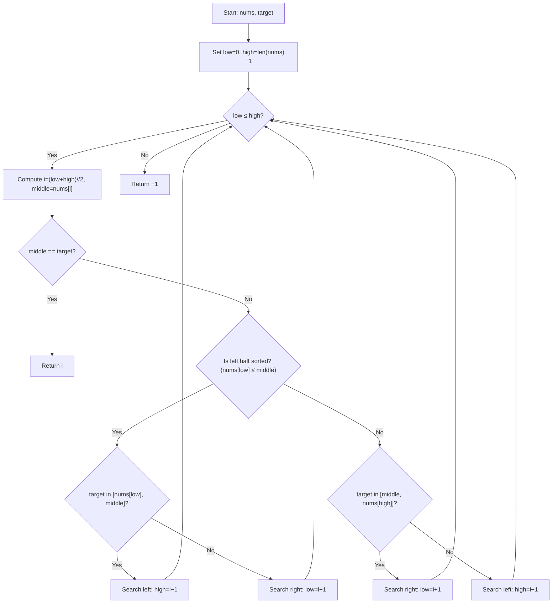

## Data Structures

**`nums`**

* A list of integers representing a sorted array rotated at some pivot, with no duplicates.

**`target`**

* The integer value to search for in **nums**.

**`low`, `high`**

* Integer indices bounding the current search range within **nums**.

  * **low** starts at 0.
  * **high** starts at len(**nums**) − 1.

**`i`**, **`middle`**

* **i** is the midpoint index `(low + high) // 2`.
* **middle** is the value `nums[i]`.

---

## What happens in search()



1. **Initialize pointers**

   ```python
   low, high = 0, len(nums) - 1
   ```

   * Define the initial search interval across the entire array.

2. **Binary search loop**

   ```python
   while low <= high:
   ```

   * Continue as long as the interval is valid.

3. **Compute midpoint**

   ```python
   i = (low + high) // 2
   middle = nums[i]
   ```

   * **i** is the center index; **middle** its value.

4. **Check for match**

   ```python
   if middle == target:
       return i
   ```

   * If found, return the index immediately.

5. **Determine which half is sorted**

   ```python
   if nums[low] <= middle:
       # Left half from low to i is sorted
   else:
       # Right half from i to high is sorted
   ```

   * Compare **nums\[low]** to **middle** to see if the left segment is in ascending order.

6. **Decide which half to search**

   * **If left half is sorted**:

     * If **target** lies between **nums\[low]** and **middle**, narrow to left:

       ```python
       high = i - 1
       ```
     * Otherwise, search right:

       ```python
       low = i + 1
       ```
   * **If right half is sorted**:

     * If **target** lies between **middle** and **nums\[high]**, narrow to right:

       ```python
       low = i + 1
       ```
     * Otherwise, search left:

       ```python
       high = i - 1
       ```

7. **Not found**

   ```python
   return -1
   ```

   * When **low** exceeds **high**, the target is not in the array.

---

## Complexity

* **Time:** O(log n)

  * Each iteration halves the search space.

* **Space:** O(1)

  * Uses only a fixed number of index and value variables.
