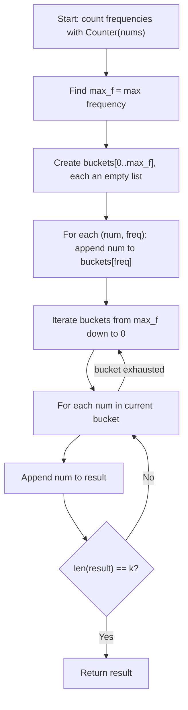

## Data Structures

**Inputs:**

* **`nums: List[int]`**: the input array of integers (may contain duplicates).
* **`k: int`**: the number of most-frequent elements to return.

**Auxiliary Variables:**

* **`counter`**: a `Counter` (hash map) mapping each distinct number to its frequency in `nums`.
* **`max_f`**: the highest frequency among all elements — determines the size of the bucket array.
* **`buckets`**: a list of lists indexed by frequency. `buckets[f]` holds every number that appears exactly `f` times.
* **`result`**: accumulator list that collects the top-k elements as we scan buckets from highest to lowest frequency.

## Overall Approach

We use **bucket sort by frequency**. First, count every element's frequency with a hash map. Then distribute numbers into buckets indexed by their frequency. Finally, iterate from the highest-frequency bucket downward, collecting elements until we have `k` of them. This avoids sorting and runs in linear time.



## Step-by-Step Walkthrough

1. **Count element frequencies**

   ```python
   counter = Counter(nums)
   ```

   Build a frequency map in a single pass. For `nums = [1,1,1,2,2,3]`, this gives `{1: 3, 2: 2, 3: 1}`.

2. **Create frequency buckets**

   ```python
   max_f = max(counter.values())
   buckets = [[] for i in range(max_f + 1)]
   ```

   Allocate `max_f + 1` empty lists. The maximum possible frequency is `n` (all elements identical), so the bucket array is at most size `n + 1`.

3. **Distribute numbers into buckets**

   ```python
   for num, freq in counter.items():
       buckets[freq].append(num)
   ```

   Each number lands in the bucket matching its frequency. Continuing the example: `buckets[3] = [1]`, `buckets[2] = [2]`, `buckets[1] = [3]`.

4. **Collect the top-k elements from highest frequency down**

   ```python
   result = list()
   for bucket in reversed(buckets):
       for num in bucket:
           result.append(num)
           if len(result) == k:
               return result
   ```

   Walk from `buckets[max_f]` toward `buckets[0]`. Each element encountered is more frequent than (or tied with) those in later buckets. Stop as soon as `k` elements are collected.

## Complexity Analysis

* **Time:** $O(n)$

    Counting frequencies is $O(n)$. Finding `max_f` is $O(d)$ where $d$ is the number of distinct elements ($d \le n$). Building the buckets is $O(d)$. The final collection pass visits at most $d$ elements total across all buckets. Every step is bounded by $O(n)$.

* **Space:** $O(n)$

    The `counter` stores up to $d \le n$ entries. The `buckets` array has at most $n + 1$ slots, and the total number of elements across all buckets is $d$. The `result` list holds $k$ elements. Overall: $O(n)$.
