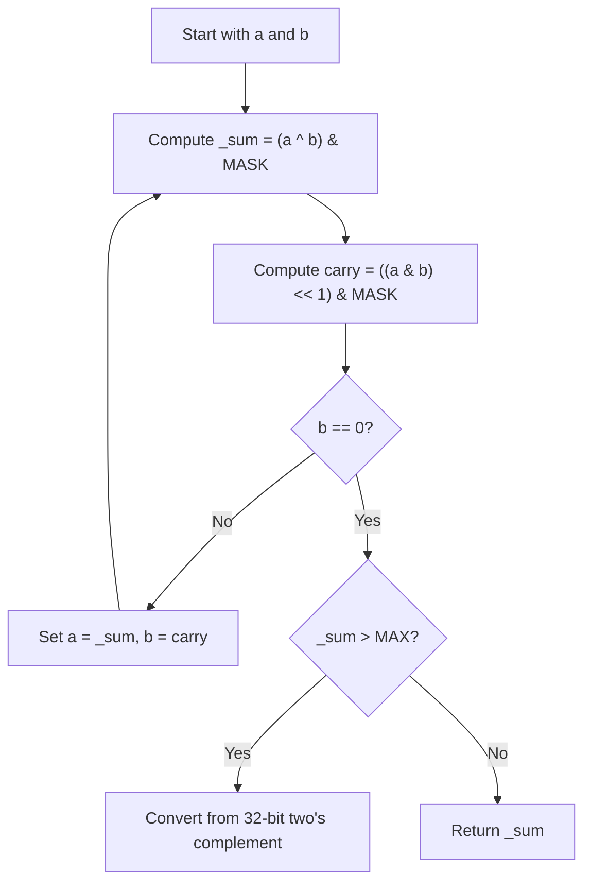

## Data Structures

* **`a`** and **`b`**: the two input integers; during the loop, `a` is updated to the sum bits without carry and `b` is updated to the carry bits.
* **`MASK`**: `(2^32) - 1`, used to limit intermediate results to 32 bits.
* **`MAX`**: the largest positive signed 32-bit integer, used to detect negative answers in two's complement form.
* **`_sum`**: the sum bits without carry.
* **`carry`**: the carry bits shifted left by one position.

## Overall Approach

The solution adds two integers using **bit manipulation** instead of the `+` operator.

* `a ^ b` computes the sum bits where there is no carry.
* `(a & b) << 1` computes the carry bits.
* Repeating this process eventually removes all carries.

Because Python integers are not fixed-width, the implementation uses a 32-bit mask to emulate the behavior expected by the problem.



## Complexity Analysis

* **Time Complexity**: $O(1)$ for 32-bit integers, since the loop can only propagate carries across a fixed number of bits.
* **Space Complexity**: $O(1)$.

## Key Insights

* XOR gives addition without carry, while AND identifies positions that generate carry.
* The mask keeps intermediate values inside the 32-bit range.
* The final conversion is needed only when the 32-bit result represents a negative number.

## Source Code Analysis

```python
class Solution:
    def getSum(self, a: int, b: int) -> int:
        MASK = (1 << 32) - 1
        MAX = (1 << 31) - 1

        _sum = (a ^ b) & MASK
        carry = ((a & b) << 1) & MASK
        
        while b != 0:
            _sum = (a ^ b) & MASK
            carry = ((a & b) << 1) & MASK
            a, b = _sum, carry
    
        if _sum > MAX:
            return ~(_sum ^ MASK)
        
        return _sum
```

## Related Problems

* Reverse Bits
* Number of 1 Bits
* Counting Bits
