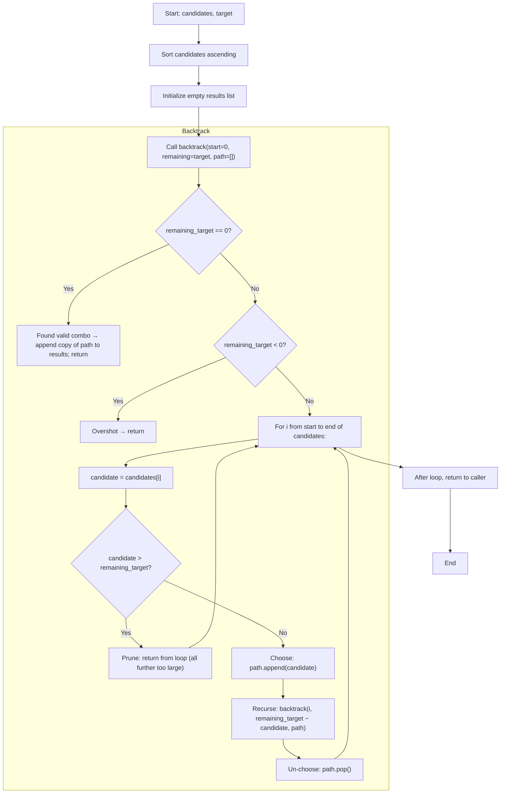

## Data Structures

**`candidates`**

* A list of distinct positive integers, sorted in ascending order to enable early pruning.

**`target`**

* An integer goal sum we want to achieve by combining elements from **candidates** (with repetition allowed).

**`results`**

* A list of lists, where each inner list is one combination of numbers summing to **target**.

**`path`**

* A temporary list used during backtracking to build up one candidate combination.

**`start`**, **`remaining_target`**

* **start**: integer index in **candidates** indicating which elements are still eligible for use (ensures combinations are non‑decreasing and avoids duplicates).
* **remaining\_target**: the sum still needed to reach **target**.

---

## What happens in `combinationSum()`



1. **Sort for pruning**

   ```python
   candidates.sort()
   ```

   * Ensures that once a candidate exceeds the remaining target, all later ones will, too.

2. **Prepare results container**

   ```python
   results = []
   ```

3. **Backtracking function**

   ```python
   def backtrack(start, remaining_target, path):
       if remaining_target == 0:
           results.append(path.copy())
           return
       if remaining_target < 0:
           return
       for i in range(start, len(candidates)):
           candidate = candidates[i]
           if candidate > remaining_target:
               return
           path.append(candidate)
           backtrack(i, remaining_target - candidate, path)
           path.pop()
   ```

   * **Base case (success):** `remaining_target == 0` → record a copy of **path** in **results**.
   * **Base case (failure):** `remaining_target < 0` → overshot, backtrack immediately.
   * **Loop over choices:** from index **start** onward, to allow reuse of the same element and enforce non-decreasing order within **path**.
   * **Prune:** if the current candidate exceeds what's left, break the loop (because sorted).
   * **Choose → Recurse → Un-choose:** standard backtracking pattern.

4. **Initial call and return**

   ```python
   backtrack(0, target, [])
   return results
   ```

   * Start with an empty path and the full target; return all found combinations.

---

## Complexity

* **Time:** Exponential in the worst case.

  * The depth of recursion can go up to `target / min(candidates)`.
  * At each level, you may choose among up to `len(candidates)` options.
  * Upper bound roughly O(k^(T/m)), where k = number of candidates, T = target, m = minimum candidate value.

* **Space:**

  * **O(T/m)** recursive call stack depth.
  * **O(#solutions × average\_solution\_length)** for storing all valid combinations in **results**.
