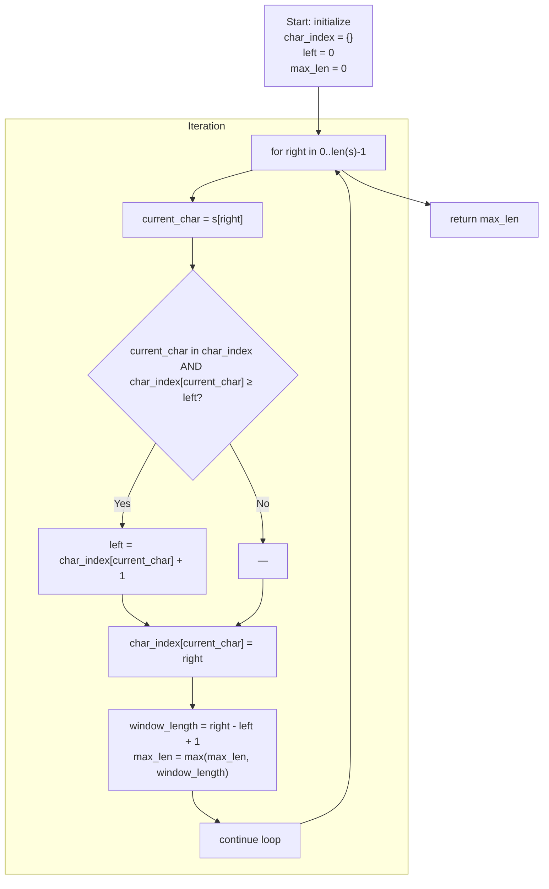

## Data Structures

* **`s: str`**
  The input string in which we search for the longest substring without repeating characters.

* **`char_index: Dict[str, int]`**
  A dictionary (hash map) that maps each character to its most recent index in `s`.
  Used to quickly determine if a character has already appeared within the current window and where.

* **`left: int`**
  The start index of the sliding window (inclusive). Every iteration, this may move rightward to ensure no duplicates exist in the window.

* **`max_len: int`**
  Tracks the length of the longest valid (duplicate‐free) substring found so far.

* **`right: int`**
  The end index of the sliding window (inclusive) as we iterate forward through `s`.

## Overall Approach

We use a **sliding‐window** technique with two pointers (`left` and `right`) plus the `char_index` map to enforce uniqueness in O(n) time. At each step, we expand the window by moving `right` and check if the newly included character has already appeared inside the current window. If it has, we advance `left` just past the previous occurrence to remove the duplicate. We update `max_len` whenever we have a longer duplicate‐free window.

1. **Initialization**

   ```python
   char_index = {}       # empty map: character → its most recent index
   left = 0              # window start
   max_len = 0           # best answer so far
   ```

   If `s` is empty, we will eventually return 0.

2. **Iterate with right pointer**
   For `right` from `0` to `len(s) - 1`:

   * Let `current_char = s[right]`.
   * **Check for duplicate inside window**

     ```python
     if current_char in char_index and char_index[current_char] >= left:
         # We have seen this character before _within_ the current window [left..right-1].
         # Slide `left` to one position beyond that previous index to drop the duplicate.
         left = char_index[current_char] + 1
     ```
   * **Update the map**

     ```python
     char_index[current_char] = right
     ```
   * **Update max length**
     Now the window is `[left..right]`, guaranteed duplicate‐free. Its length is:

     ```python
     window_length = right - left + 1
     max_len = max(max_len, window_length)
     ```

3. **Return result**
   After scanning all positions, `max_len` holds the length of the longest substring without repeating characters.

## Step-By-Step Flowchart



1. **`Start`**:

   * Create an empty dictionary `char_index`.
   * Set `left = 0` and `max_len = 0`.

2. **`Loop`** for each `right` index:

   * **`SetChar`**: Read `current_char = s[right]`.
   * **`CheckDup`**: If `current_char` is already in `char_index` and its recorded index is ≥ `left`, it means that character falls inside our current window `[left..right-1]`.

     * If **yes**, move `left` to `char_index[current_char] + 1` to drop the previous occurrence—ensuring no duplicates remain.
     * If **no**, keep `left` as-is.
   * **`UpdateMap`**: Record or overwrite the index of `current_char` as `right`.
   * **`ComputeLen`**: The current window is `[left..right]`, so its length is `(right - left + 1)`. Update `max_len` if this is larger than before.
   * **`NextRight`**: Loop to the next `right` index.

3. **`End`**: Once `right` has reached the end of the string, return `max_len`.

## Complexity

* **Time:** \$O(n)\$

  * We make a single pass through the string of length \$n\$.
  * Each character is processed once as `right` advances, and dictionary lookups/inserts (`char_index[...]`) take amortized \$O(1)\$.
  * The `left` pointer only ever moves forward (never back), so each character’s index is examined at most twice: once for reading, once for removing past duplicates.

* **Space:** \$O(\min(n, k))\$

  * The dictionary `char_index` holds at most one entry per unique character in the current window.
  * In the worst case (all characters distinct), space is \$O(n)\$. If the character set is limited (e.g., ASCII), it’s \$O(k)\$ for that fixed alphabet size.
