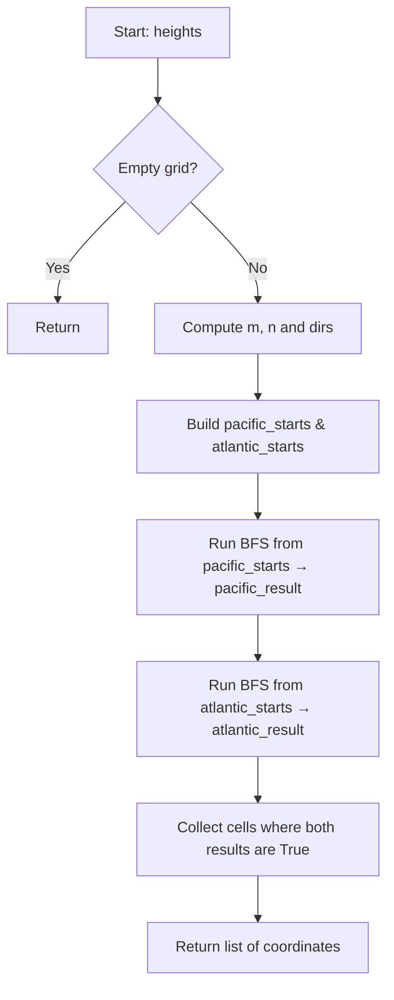

## Data Structures

**`heights`**

* A 2D list of integers, where `heights[r][c]` is the elevation at row `r`, column `c`.

**`m`, `n`**

* Dimensions of the grid:

  * **m** = number of rows (`len(heights)`).
  * **n** = number of columns (`len(heights[0])`).

**`dirs`**

* A list of four direction vectors for exploring neighbors:

  ```
  [(-1, 0), (1, 0), (0, -1), (0, 1)]
  ```

**`reachable`**

* A Boolean m×n matrix used in each BFS to mark which cells can reach the given ocean.

**`queue`**

* A double‑ended queue (from `collections.deque`) holding coordinates to process in BFS.

**`pacific_starts`, `atlantic_starts`**

* Lists of border coordinates where water can flow into the respective ocean:

  * **pacific\_starts**: all cells in the top row or left column.
  * **atlantic\_starts**: all cells in the bottom row or right column.

**`pacific_result`, `atlantic_result`**

* Two reachable matrices produced by running BFS from each ocean’s border.

---

## What happens in `pacificAtlantic()`



1. **Edge‑case check**

   * If `heights` is empty or has no columns, return immediately.

2. **Grid setup**

   * Compute **m**, **n**, and the four **dirs** for neighbor offsets.

3. **Define BFS helper**

   * `bfs(start_coordinates)`:

     1. Initialize an m×n **reachable** matrix to False.
     2. Mark each start coordinate as True and enqueue it.
     3. While the **queue** is not empty:

        * Dequeue `(row, col)`.
        * For each direction `(dr, dc)`, compute neighbor `(r + dr, c + dc)`.
        * If neighbor is in bounds, not yet reachable, and its height ≥ current cell’s height, mark reachable and enqueue.
     4. Return the reachable matrix.

4. **Prepare ocean borders**

   * **pacific\_starts** = all `(0, c)` for top row and `(r, 0)` for left column.
   * **atlantic\_starts** = all `(m−1, c)` for bottom row and `(r, n−1)` for right column.

5. **Compute reachability**

   * `pacific_result = bfs(pacific_starts)`
   * `atlantic_result = bfs(atlantic_starts)`

6. **Intersect results**

   * For every cell `(r, c)`, if `pacific_result[r][c]` and `atlantic_result[r][c]` are both True, include `(r, c)` in the answer list.

7. **Return**

   * The list of all coordinates from which water can flow to both oceans.

---

## Complexity

* **Time:** O(m × n)

  * Each BFS visits and processes each cell at most once, checking four neighbors → O(m n).
  * Two BFS calls → still O(m n).

* **Space:** O(m × n)

  * Two reachable matrices of size m×n and a queue that in the worst case can hold O(m n) entries.
