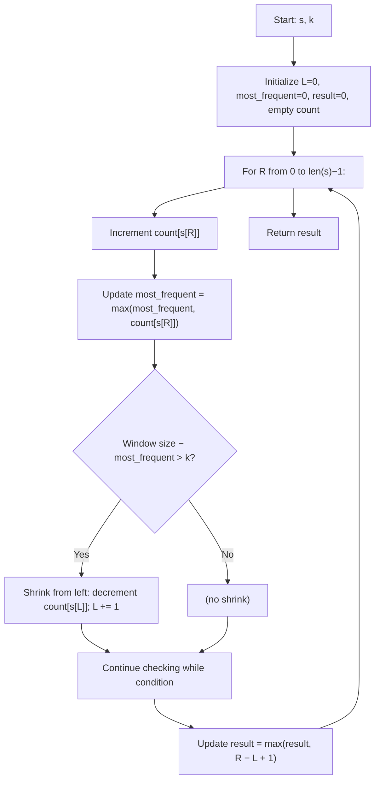

## Data Structures

**`s`**

* Input string of uppercase characters.

**`k`**

* Integer, maximum number of character replacements allowed.

**`count`**

* A mapping from character to its current frequency within the sliding window.

**`L`, `R`**

* Integer indices delimiting the left and right edges of the sliding window.

  * **L** starts at 0.
  * **R** is the loop variable.

**`most_frequent`**

* Integer tracking the highest frequency of any single character in the current window.

**`result`**

* Integer tracking the length of the longest valid window seen so far.

---

## What happens in `characterReplacement()`



1. **Initialize**

   * Set window pointers **L = 0**, **most\_frequent = 0**, **result = 0**, and an empty frequency map **count**.

2. **Expand right end**

   * For each index **R** and character **current\_char = s\[R]**:

     1. Increment **count\[current\_char]**.
     2. Update **most\_frequent** to the highest count seen in this window.

3. **Shrink left end if needed**

   * While the window size minus **most\_frequent** exceeds **k** (i.e., we’d need more than **k** replacements to make all chars match the majority):

     * Decrement **count\[s\[L]]** and move **L** right by one.

4. **Record best window**

   * After any necessary shrinking, the window **\[L…R]** is valid. Update

     ```
     result = max(result, R − L + 1)
     ```

5. **Return**

   * **result** holds the maximum length of a substring where up to **k** replacements make all characters identical.

---

## Complexity

* **Time:** O(n), where n = length of **s**.

  * Each index **R** is visited once; **L** only moves forward, so both pointers traverse the string linearly.

* **Space:** O(1) (or O(26)), since **count** stores at most 26 letters.
