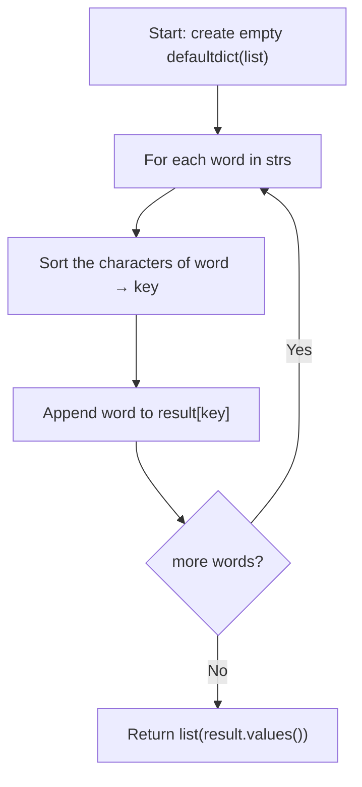

## Data Structures

* **`result`**: a `defaultdict(list)` mapping each canonical key to the list of words that share that key. Anagrams produce the same key, so they land in the same bucket.
* **`key`**: the sorted characters of a word joined into a string, used as the hash-map key (e.g. `"eat"` → `"aet"`).

## Overall Approach

Two strings are anagrams if and only if they contain the same characters in the same frequencies. Sorting each word produces a **canonical form** that is identical for all anagrams. We iterate through the input, sort each word to build a key, and group words by that key in a hash map.



1. Initialise `result` as a `defaultdict(list)` so that new keys automatically start with an empty list.

   ```python
   result: defaultdict = defaultdict(list)
   ```

2. For every word, sort its characters and join them into a string to form the canonical key.

   ```python
   key = "".join(sorted(word))
   ```

3. Append the original word to the list stored under that key.

   ```python
   result[key].append(word)
   ```

4. After processing all words, return every bucket as a list of lists.

   ```python
   return list(result.values())
   ```

The source file also contains a commented-out **histogram approach** that builds a 26-element frequency array instead of sorting. That variant runs in $O(k)$ per word but the active implementation uses the sort-based method described above.

## Complexity Analysis

Let $n$ be the number of strings and $k$ the maximum length of a string.

* **Time Complexity:** $O(n \cdot k \log k)$ — each of the $n$ words is sorted in $O(k \log k)$.
* **Space Complexity:** $O(n \cdot k)$ — the hash map stores every input string.

## Key Insights

* Sorting a word is the simplest way to derive a canonical key shared by all its anagrams.
* `defaultdict(list)` avoids key-existence checks and keeps the grouping logic to a single line.
* The alternative histogram key (`bytes` of a 26-element count array) trades the $O(k \log k)$ sort for an $O(k)$ scan, which can be faster for very long strings.
