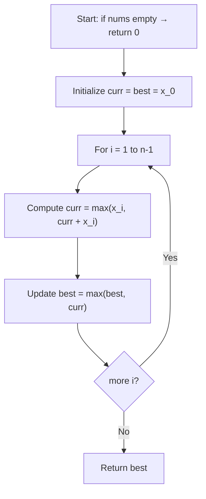

## Data Structures

**Inputs:**

* `nums`: sequence of real numbers $\{x_i\}_{i=0}^{n-1}$.

**Auxiliary Variables:**

* $\mathrm{curr}(i)$: maximum subarray sum ending exactly at index $i$.
* $\mathrm{best}$: overall maximum seen so far.
* $i$: loop index from 0 to $n-1$.

## Overall Approach

We apply **Kadane’s algorithm**, which exploits the fact that the best subarray ending at $i$ either

1. **Extends** the best ending at $i-1$, or
2. **Starts anew** at $i$.

Thus we maintain a running sum that resets whenever it becomes negative.

### I. Initialization

* If $n=0$, answer is 0 by definition.
* Otherwise set

  $$
    \mathrm{curr}(0) = x_0,\quad
    \mathrm{best} = x_0.
  $$

### II. Recurrence Relation

For each $i\in[1,n-1]$:

1. **Local optimum** at $i$:

   $$
     \mathrm{curr}(i)
     = \max\bigl(x_i,\;\mathrm{curr}(i-1) + x_i\bigr).
   $$
2. **Global update**:

   $$
     \mathrm{best}
     = \max\bigl(\mathrm{best},\;\mathrm{curr}(i)\bigr).
   $$

At the end, $\mathrm{best}$ holds the maximum subarray sum.

## Example

For $\{x_i\} = [-2,\,1,\,-3,\,4,\,-1,\,2,\,1,\,-5,\,4]$:

|  $i$  |  0  |  1  |  2  |  3  |  4  |  5  |  6  |  7  |  8  |
| :---: | :-: | :-: | :-: | :-: | :-: | :-: | :-: | :-: | :-: |
| $x_i$ |  -2 |  1  |  -3 |  4  |  -1 |  2  |  1  |  -5 |  4  |
|  curr |  -2 |  1  |  -2 |  4  |  3  |  5  |  6  |  1  |  5  |
|  best |  -2 |  1  |  1  |  4  |  4  |  5  |  6  |  6  |  6  |

The maximum subarray is $[4, -1, 2, 1]$ with sum **6**.

## Complexity

* **Time:** $\displaystyle O(n)$, one pass through the array.
* **Space:** $\displaystyle O(1)$, only two scalars (`curr` and `best`) in addition to the input.
