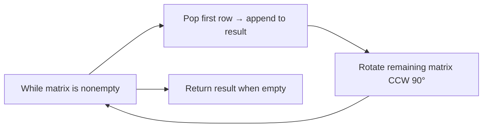

## Data Structures

**Inputs:**

* An $m\times n$ matrix of elements.

**Auxiliary Variables:**

* **`result`**: list that accumulates the elements in spiral order.
* **`matrix`** (mutated): the working matrix whose “outer layer” is peeled off each iteration.

## Overall Approach

We repeatedly extract the current top row of the matrix, append its elements to `result`, then rotate the remaining submatrix counter-clockwise by 90°.  This has the effect of always exposing the next “outer layer” along what was originally the right column, bottom row, and left column, in turn.  Concretely:

1. **Peel** off the first row: that yields the next segment of the spiral.
2. **Rotate** the remainder: a transpose plus reverse of rows implements a 90° CCW rotation.
3. **Repeat** until nothing remains.

This transforms the two-dimensional spiral traversal into a sequence of simple row extractions and matrix rotations.

---

## Complexity Analysis

* **Time Complexity:**
  Each extraction/removal of a row costs $O(n)$, and each rotation (transpose + reverse) costs $O(k\ell)$ for the current $\,k\times \ell$ submatrix.  Summed over all layers, this remains $O(mn)$.
* **Space Complexity:**

  * **Output:** $O(mn)$ to store the spiral order.
  * **In-place matrix mutation:** no asymptotic extra space beyond the input and output lists.

## Source Code Analysis (Conceptual)

1. **Initialize** an empty `result`.
2. **Loop** as long as any rows remain:

   * **Remove** and record the first row’s elements.
   * **Reorient** the leftover matrix by transposing and reversing row order.
3. **Return** the concatenated `result`.

This avoids manual index-boundary tracking by reducing the problem via matrix rotations rather than explicit pointer manipulation.

