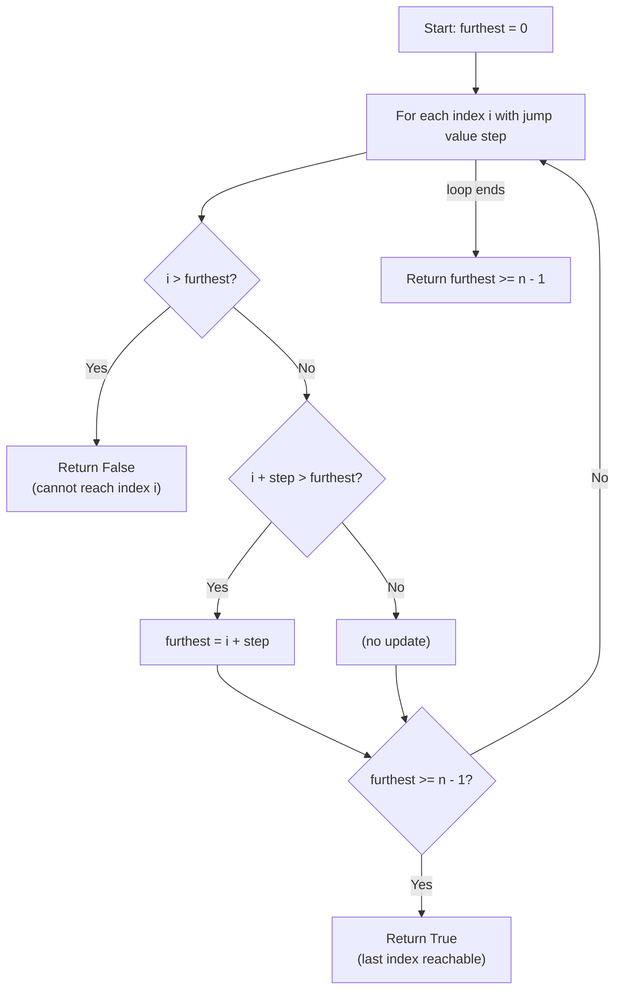

## Data Structures

- **`n: int`** — length of the `nums` array; used to identify the target index (`n - 1`).
- **`furthest: int`** — the maximum index reachable so far. This single variable replaces the need for a visited set or DP table.
- **`i: int`** — current position in the array.
- **`step: int`** — `nums[i]`, the maximum jump length from position `i`.

## Overall Approach

Scan left to right, maintaining the farthest index reachable from any position seen so far. At each position, if the current index exceeds `furthest`, we are stuck and return `False`. Otherwise, extend `furthest` to `i + step` when that is larger, and short-circuit with `True` as soon as the last index is reachable.



## Step-by-Step Breakdown

### 1. Initialisation

```python
n = len(nums)
furthest = 0
```

`furthest` starts at `0` because we always begin at the first index.

### 2. Iterate through each position

```python
for i, step in enumerate(nums):
```

We examine every index from `0` to `n - 1`.

### 3. Unreachable check

```python
if i > furthest:
    return False
```

If the current index `i` is beyond `furthest`, no previous jump could have landed here — the last index is unreachable.

### 4. Extend the reachable range

```python
if furthest < i + step:
    furthest = i + step
```

From position `i` we can jump up to `i + step`. If that exceeds our current best, update `furthest`.

### 5. Early success

```python
if furthest >= n - 1:
    return True
```

As soon as the last index is within reach, return immediately — no need to inspect remaining positions.

### 6. Final fallback

```python
return furthest >= n - 1
```

Covers the edge case where the loop completes (e.g., single-element array).

## Example

`nums = [2, 3, 1, 1, 4]`

| i | step | furthest before | i > furthest? | new furthest | >= n-1? |
|:-:|:----:|:---------------:|:-------------:|:------------:|:-------:|
| 0 | 2    | 0               | No            | 2            | No      |
| 1 | 3    | 2               | No            | 4            | Yes ✓   |

Returns `True` — we can reach index 4 after processing index 1.

`nums = [3, 2, 1, 0, 4]`

| i | step | furthest before | i > furthest? | new furthest | >= n-1? |
|:-:|:----:|:---------------:|:-------------:|:------------:|:-------:|
| 0 | 3    | 0               | No            | 3            | No      |
| 1 | 2    | 3               | No            | 3            | No      |
| 2 | 1    | 3               | No            | 3            | No      |
| 3 | 0    | 3               | No            | 3            | No      |
| 4 | 4    | 3               | Yes ✗         | —            | —       |

Returns `False` — index 4 is beyond `furthest` (3).

## Complexity

- **Time:** O(n) — single pass through the array; each element is visited at most once.
- **Space:** O(1) — only a fixed number of integer variables regardless of input size.
