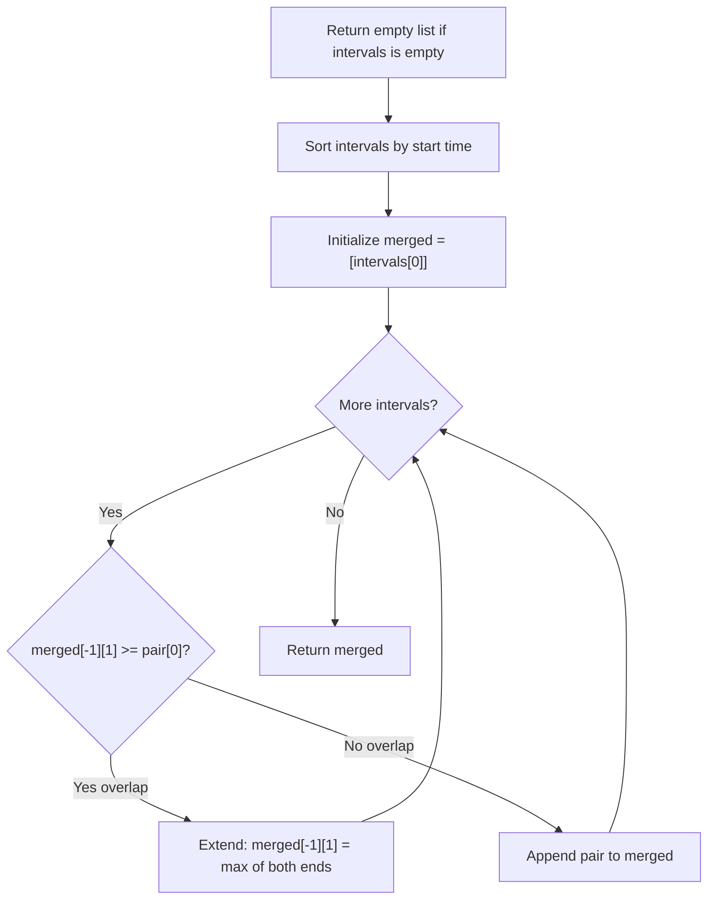

## Data Structures

**`intervals`**  
- The input list of `[start, end]` pairs, sorted in-place by start time.

**`merged`**  
- A result list initialized with the first interval. Each new interval is either merged into the last element or appended as a new entry.

## What happens in `merge()`?



1. **Edge case**  
   ```python
   if not intervals:
       return list()
   ```

2. **Sort by start time**  
   ```python
   intervals.sort(key=lambda pair: pair[0])
   ```
   Sorting guarantees that for any two adjacent intervals, the first one starts no later than the second. This means we only need to check the end of the last merged interval against the start of the current one.

3. **Seed the result**  
   ```python
   merged = [intervals[0]]
   ```

4. **Iterate and merge**  
   For each remaining interval `pair`:
- **Overlap** — `merged[-1][1] >= pair[0]`:  
     The current interval starts before (or exactly when) the last merged interval ends, so they overlap. Extend the end if needed:
     ```python
     if pair[1] > merged[-1][1]:
         merged[-1][1] = pair[1]
     ```
- **No overlap** — the current interval starts after the last merged interval ends:
     ```python
     merged.append(pair)
     ```

5. **Return result**  
   `merged` now contains all non-overlapping intervals.

## Complexity

- **Time:** $O(n \log n)$, dominated by the sort. The single pass through intervals is $O(n)$.  
- **Space:** $O(n)$ for the `merged` output list in the worst case (no overlaps).
