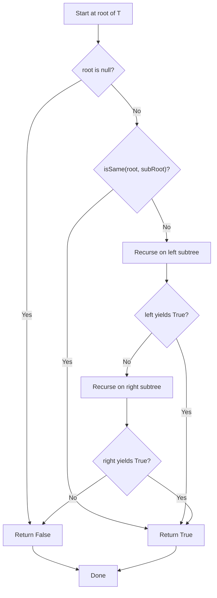
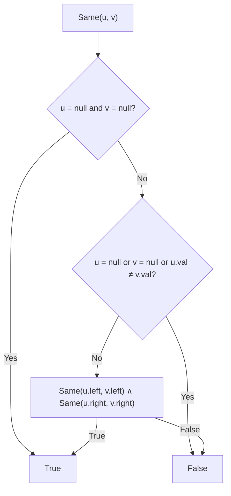
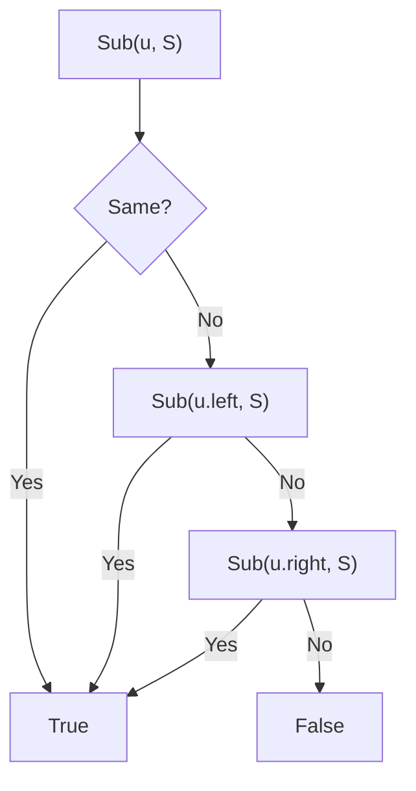

## Data Structures

**Inputs:**

* `T`: binary tree with $N$ nodes (rooted at `root`).
* `S`: binary tree with $M$ nodes (rooted at `subRoot`).

**Auxiliary Variables:**

* `node`, `subNode`: pointers used by the helper `isSame` to walk two trees in tandem.

## What Happens in `isSubtree`?

We reduce the problem to two tasks:

1. **Tree‐Equality Check** (`isSame`): decide if two trees of sizes $m$ and $m$ are identical in structure and node‐values.
2. **Traversal**: scan every node of $T$, invoking the equality check at each one until we find a match or exhaust $T$.



### I. Helper: `isSame(node, subNode)`

We perform a synchronized preorder traversal of the two trees:

1. **Both null**: return **True**.
2. **One null**: return **False**.
3. **Value mismatch**: return **False**.
4. **Otherwise**: recurse on left children **and** right children.

Mathematically, if we denote by

$$
  \mathrm{Same}(u,v)
$$

the predicate “subtrees at $u$ and $v$ are identical,” then



### II. Main Procedure: `isSubtree(root, subRoot)`

We define

$$
  \mathrm{Sub}(u,S)
$$

as “tree at node $u$ contains $S$ as a subtree.” Then



At each node $u$ of $T$, we first test $\mathrm{Same}(u,S)$; if that fails, we recursively query the left and right children of $u$.

## Example

Let

```
T:
       3
      / \
     4   5
    / \
   1   2
```

```
S:
   4
  / \
 1   2
```


* At $u=3$, $\mathrm{Same}(3,S)$ fails (values differ).
* Recurse to $u=4$: now $\mathrm{Same}(4,S)$ holds, since both structure and values match exactly.
  → return **True**.

## Complexity Analysis

**Time Complexity:**
In the worst case, for each of the $N$ nodes in $T$ we invoke `isSame`, which may explore up to $M$ nodes.

$$
O(N\times M)
$$

**Space Complexity:**

Recursion depth is bounded by the height of $T$, say $H$, so

$$
O(H)
$$
