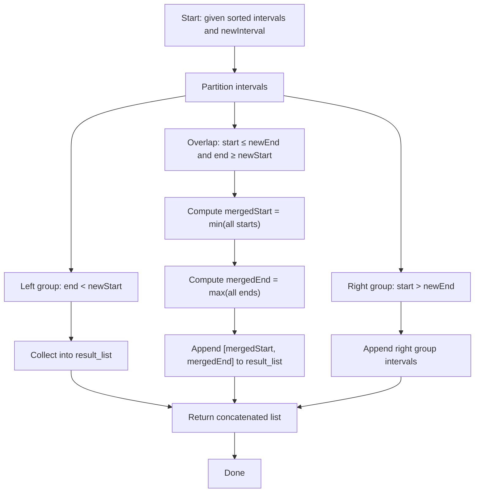

## Data Structures

**Inputs:**

* `intervals`: a list of non-overlapping, sorted intervals $[s_i,e_i]$.
* `newInterval`: a single interval $[s,e]$ to insert and merge.

**Auxiliary Variables:**

* **Left group**: all intervals ending before $s$.
* **Right group**: all intervals starting after $e$.
* **Overlap group**: intervals that intersect $[s,e]$, used to expand the new interval’s bounds.
* **Merged interval**: a pair $[\min\!s,\;\max\!e]$ covering all overlaps and the original new interval.

## Overall Approach

We partition the existing intervals into three sets—left, overlap, and right—based on their relation to the new interval, then merge overlaps by taking the minimum start and maximum end. Finally, we splice the merged interval between the left and right groups.

### I. Initialization

* Let $[s,e] =$ `newInterval`.
* Prepare three empty collections:

  $$
    L = \{\},\quad O = \{\},\quad R = \{\}.
  $$

### II. Partitioning

* **Left** ($L$): intervals $[s_i,e_i]$ with $e_i < s$.
* **Right** ($R$): intervals $[s_i,e_i]$ with $s_i > e$.
* **Overlap** ($O$): all others, i.e.

  $$
    s_i \le e \quad\land\quad e_i \ge s.
  $$

This single pass over the sorted list runs in $O(n)$.

---

### III. Merging Overlaps

If $O$ is non-empty, define

$$
  \text{mergedStart} = \min_{[s_i,e_i]\in O}\!s_i,\quad
  \text{mergedEnd}   = \max_{[s_i,e_i]\in O}\!e_i.
$$

Otherwise, set $\text{mergedStart}=s$, $\text{mergedEnd}=e$.

The merged interval is $[\text{mergedStart},\,\text{mergedEnd}]$.

### IV. Construct Result

Concatenate in order:

$$
  L \;+\; [\text{mergedInterval}]\;+\; R.
$$

Because input is sorted and partitions preserve order, the result remains sorted and non-overlapping.

## Example

Insert $[2,5]$ into $\bigl[[1,3],\,[6,9]\bigr]$:

1. **Left**: $\{[1,3]\}$ since $3<2$ is false → actually none.
2. **Overlap**: $[1,3]$ intersects and also $[2,5]$ itself → merge bounds = $[\min(1,2),\,\max(3,5)] = [1,5]$.
3. **Right**: $\{[6,9]\}$.

Result: $\bigl[[1,5],\,[6,9]\bigr]$.

## Complexity

* **Time:** $O(n)$ — one pass to partition and constant-time merging.
* **Space:** $O(n)$ — output list plus overlap buffer (worst case all intervals overlap).
