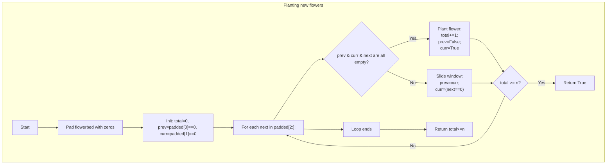

## Data Structures

**`flowerbed`**  
- A list of integers `0` or `1`, length `m`.  
  - `0` means empty plot.  
  - `1` means already planted.

**`padded`**  
- A new list of length `m+2`:  
  ```
  padded = [0] + flowerbed + [0]
  ```  
- We add one `0` at each end so we can treat edge plots uniformly.

**`total`**  
- Integer counter of how many new flowers we’ve planted so far.

**`prev`, `curr`**  
- Booleans representing whether the **previous** and **current** slots in `padded` are empty (`True` if `0`, else `False`).

## What happens in `canPlaceFlowers`?

We slide a three‑slot window (`prev`, `curr`, `next`) across `padded`. Wherever all three are empty, we “plant” at the middle slot.



I. **Pad the bed**  

```python
padded = [0] + flowerbed + [0]
total = 0
```

II. **Initialize window**  

```python
prev = (padded[0] == 0)
curr = (padded[1] == 0)
```

III. **Slide through**  

For each `f` in `padded[2:]` (this is the “next” slot):  

- **If** `prev and curr and f == 0` → we can plant at the middle:  

```python
total += 1
# simulate planting:
prev = False    # middle now “occupied”
curr = True     # f is still empty
```

- **Else** → just move the window forward:  

```python
prev = curr
curr = (f == 0)
```

- **Early exit**:  

```python
if total >= n:
    return True
```

IV. **Finish**  

After the loop, if we haven’t returned yet:

```python
return total >= n
```

## Example

```python
flowerbed = [1, 0, 0, 0, 1]
n = 1
```

1. **Pad** → `[0, 1, 0, 0, 0, 1, 0]`  
2. **Init** → `prev = True`, `curr = False`, `total = 0`  
3. **Iterate** over `[0, 0, 0, 1, 0]`:  
   - next=0 → `(True, False, 0)` → no plant → shift → `prev=False, curr=True`  
   - next=0 → `(False, True, 0)` → no plant → shift → `prev=True, curr=True`  
   - next=0 → `(True, True, 0)` → **plant!** → `total=1`, `prev=False, curr=True`  
   - Since `total (1) >= n (1)`, return **True**.

## Complexity

- **Time:**  
  - Padding: O(m).  
  - Single pass over `padded`: O(m).  
  - **Overall:** O(m).

- **Space:**  
  - O(m) for the `padded` list, plus O(1) extra.
