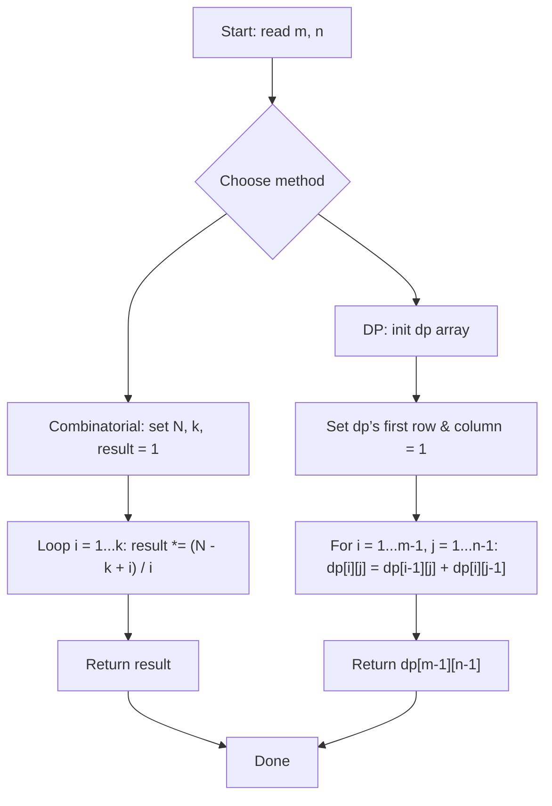

## Data Structures

**Inputs:**

* `m`: number of rows in the grid.
* `n`: number of columns in the grid.

**Auxiliary Variables:**

* **Combinatorial approach:**

* `N = m + n − 2`: total moves required (down + right).
* `k = min(m−1, n−1)`: the smaller of the two move-counts.
* `result`: accumulator for the binomial coefficient.

* **DP approach:**

`dp`: an $m\times n$ array where

$$
dp[i][j] = \text{number of paths to cell }(i,j).
$$

## What Happens in `uniquePaths`?

We have two mathematically equivalent strategies:

1. **Combinatorial**
Count all sequences of $(m−1)$ downs and $(n−1)$ rights:

$$
\binom{N}{k}
= \frac{N!}{k!\,(N-k)!}.
$$

2. **Dynamic Programming**
Use the fact that any path to $(i,j)$ must come either from $(i-1,j)$ or $(i,j-1)$:

$$
dp[i][j] = dp[i-1][j] + dp[i][j-1].
$$

### I. Initialization

**Combinatorial:**

$$
N = m + n - 2,\quad
k = \min(m-1, n-1),\quad
\text{result} = 1.
$$

**DP:**
Create an $m\times n$ array `dp`.
Fill the first row and first column with 1’s (only one way to move straight).

### II. Recurrence / Accumulation

1. **Combinatorial method:**

Multiply `result` by $\frac{N - k + i}{i}$ for each $i = 1\ldots k$, yielding $\binom{N}{k}$.

2. **DP method:**
   
For each interior cell,

$$
dp[i][j] = dp[i-1][j] + dp[i][j-1].
$$

## Example

For a $3\times3$ grid:

* **Combinatorial:** $N=4$, $k=2$ → $\binom{4}{2}=6$.
* **DP table:**

$$
\begin{array}{ccc}
1 & 1 & 1\\
1 & 2 & 3\\
1 & 3 & 6
\end{array}
$$

Answer = **6**.

## Complexity

**Time:**

* Combinatorial: $O(\min(m,n))$.
* DP: $O(m\cdot n)$.

**Space:**

* Combinatorial: $O(1)$.
* DP: $O(m\cdot n)$ (or $O(\min(m,n))$ with rolling array).
