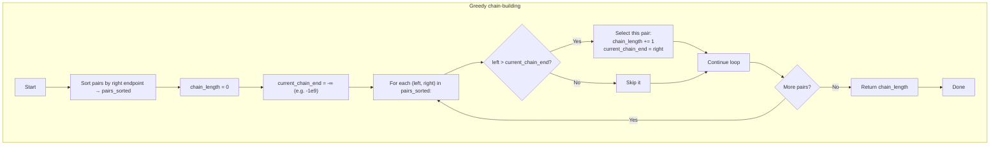

## Data Structures

**Inputs:**  
- `pairs`: list of integer pairs `[left, right]`, length `m`.

**Auxiliary Variables:**  
- `pairs_sorted`: the same pairs **sorted** by their right endpoint in ascending order.  
- `chain_length`: integer counter of how many pairs have been selected in the greedy chain.  
- `current_chain_end`: integer, the right endpoint of the last selected pair (initialized to a value smaller than any possible left).

---

## What happens in `findLongestChain`

We apply a classic **interval‑scheduling greedy**: always select the next interval whose **right** endpoint is as small as possible, subject to starting **after** the end of the last chosen one.



### Step by step

1. **Sort by end**  
   ```python
   pairs_sorted = sorted(pairs, key=lambda interval: interval[1])
   ```
2. **Initialize**  
   ```python
   chain_length      = 0
   current_chain_end = -10**9
   ```
3. **Scan intervals**  
   For each `(left, right)` in `pairs_sorted`:
   - **If** `left > current_chain_end`, we can append this pair to our chain:
     ```python
     chain_length += 1
     current_chain_end = right
     ```
   - **Else**, skip it.
4. **Return result**  
   ```python
   return chain_length
   ```

---

## Example

```python
pairs = [[1,2], [2,3], [3,4]]
```
1. Sort → `[[1,2], [2,3], [3,4]]` (already sorted).  
2. Initialize `chain_length = 0`, `current_chain_end = -1e9`.  
3. Iterate:
   - `(1,2)`: `1 > -1e9` → select → `chain_length = 1`, `current_chain_end = 2`.
   - `(2,3)`: `2 > 2`? No → skip.
   - `(3,4)`: `3 > 2` → select → `chain_length = 2`, `current_chain_end = 4`.
4. **Answer = 2** (chains like `[1,2] → [3,4]`).

---

## Complexity

- **Time:**  
  - Sorting: O(m log m).  
  - Single scan through `pairs_sorted`: O(m).  
  - **Overall:** O(m log m).

- **Space:**  
  - O(m) for the sorted list (or in‑place sort) and O(1) extra variables.
