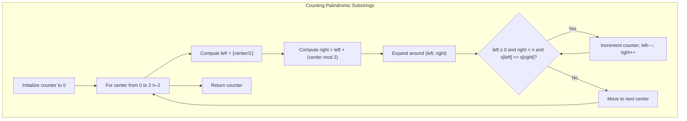

## Data Structures

**`s`**

* The input string in which we count palindromic substrings.

**`n`**

* Integer length of `s`: `n = len(s)`.

**`counter`**

* Integer accumulator (`self.counter`) tracking the total palindromic substrings found.

**`left`, `right`**

* Pointers used by the helper `expand()` to grow around a “center” and check for palindrome matches.

---

## High-Level Overview

This algorithm treats each possible center of a palindrome—both at characters and between characters—and expands outward as long as the characters match. Each valid expansion corresponds to one palindromic substring.



---

## Detailed Steps

1. **Initialize**

   ```python
   n = len(s)
   self.counter = 0
   ```

   * `n` records string length.
   * `self.counter` starts at 0.

2. **Define `expand(left, right)`**

   ```python
   def expand(left, right):
       while left >= 0 and right < n and s[left] == s[right]:
           self.counter += 1
           left -= 1
           right += 1
   ```

   * While the window `[left…right]` is within bounds and forms a palindrome (characters match), we:

     1. Count it (`self.counter += 1`),
     2. Move outward (`left -= 1`, `right += 1`).

3. **Iterate over all “centers”**

   ```python
   for center in range(2*n - 1):
       left  = center // 2
       right = left + (center % 2)
       expand(left, right)
   ```

   * There are `2n–1` centers:

     * **Odd-length palindromes:** centers on characters (`center` even → `left == right`),
     * **Even-length palindromes:** centers between characters (`center` odd → `right = left + 1`).

4. **Return the result**

   ```python
   return self.counter
   ```

   * After all expansions, `self.counter` holds the total number of palindromic substrings.

---

## Complexity

* **Time:**
  Each of the $2n-1$ centers invokes an expansion that in the worst case can span the entire string, giving

  $$
    O\bigl(n \times n\bigr) \;=\; O(n^2).
  $$

* **Space:**
  \- $O(1)$ extra space for pointers and counter (excluding the input string and recursion stack).
