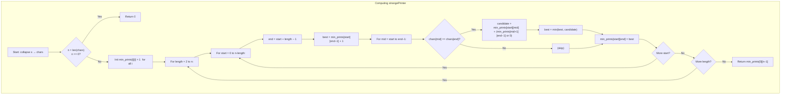

## Data Structures

**Input:**  
- `s`: the original string to print.

**Auxiliary Variables:**  
- `chars`: a list of the **compressed** characters from `s`, where consecutive duplicates have been collapsed.  
  - This reduces runs like `"aaa"` to a single `"a"`.  
- `n`: integer, the length of `chars`.  
- `min_prints`: an `n × n` 2D list, where  
  ```
  min_prints[i][j] = minimum number of printer turns needed
                     to print the substring chars[i..j].
  ```

---

## What happens in `strangePrinter(s)`?

We use **interval DP** on the compressed character array `chars`. For each substring `chars[i..j]`, we compute the fewest turns needed, exploiting the fact that if `chars[end]` matches some `chars[mid]` within the interval, we can merge their printing in one turn.



### I. **Collapse string**  
```python
chars = []
for ch in s:
    if not chars or chars[-1] != ch:
        chars.append(ch)
n = len(chars)
if n == 0:
    return 0
```
Removes consecutive duplicates; empty result → 0 turns.

### II. **Base case**  
Each single character needs exactly one turn:
```python
for i in range(n):
    min_prints[i][i] = 1
```

### III. **Build up larger intervals**  
For each `length` from `2` to `n`, for each `start` index:
1. Let `end = start + length − 1`.  
2. **Worst case**: print `chars[start..end−1]` in their optimal turns, then one extra turn for `chars[end]`:
   ```python
   best = min_prints[start][end−1] + 1
   ```
3. **Try merging**: for any `mid` in `[start..end−1]` with `chars[mid] == chars[end]`, we can extend the turn that prints at `mid` to also cover `end`.  
   - Cost to handle `[start..mid]` remains `min_prints[start][mid]`.  
   - The “gap” between `mid` and `end` is `[mid+1..end−1]`; if non‑empty, it costs `min_prints[mid+1][end−1]`, else `0`.  
   ```python
   candidate = (
     min_prints[start][mid]
     + (min_prints[mid+1][end−1] if mid+1 <= end−1 else 0)
   )
   best = min(best, candidate)
   ```
4. Store `best` as `min_prints[start][end]`.

### IV. **Return result**  
```python
return min_prints[0][n−1]
```
This is the minimum turns to print the entire compressed sequence.

---

## Example

```python
s = "aaabbb"
```
1. **Collapse** → `chars = ['a', 'b']`, `n = 2`.  
2. **Base** →  
   ```
   min_prints = [[1, 0],
                 [0, 1]]
   ```
3. **length = 2**, `start = 0`, `end = 1`:  
   - Worst case: `min_prints[0][0] + 1 = 1 + 1 = 2`.  
   - Try merge: `chars[0]='a' ≠ chars[1]='b'` → no improvement.  
   → `min_prints[0][1] = 2`.
4. **Answer** → `2`.  
   (We need one turn for all `a`’s, one for all `b`’s.)

---

## Complexity

- **Time:**  
  - Let `n = len(chars) ≤ len(s)`.  
  - We fill an `n×n` DP table; for each cell we may scan up to `n` possible `mid` points → **O(n³)**.

- **Space:**  
  - **O(n²)** for the `min_prints` table, plus **O(n)** for `chars`.
