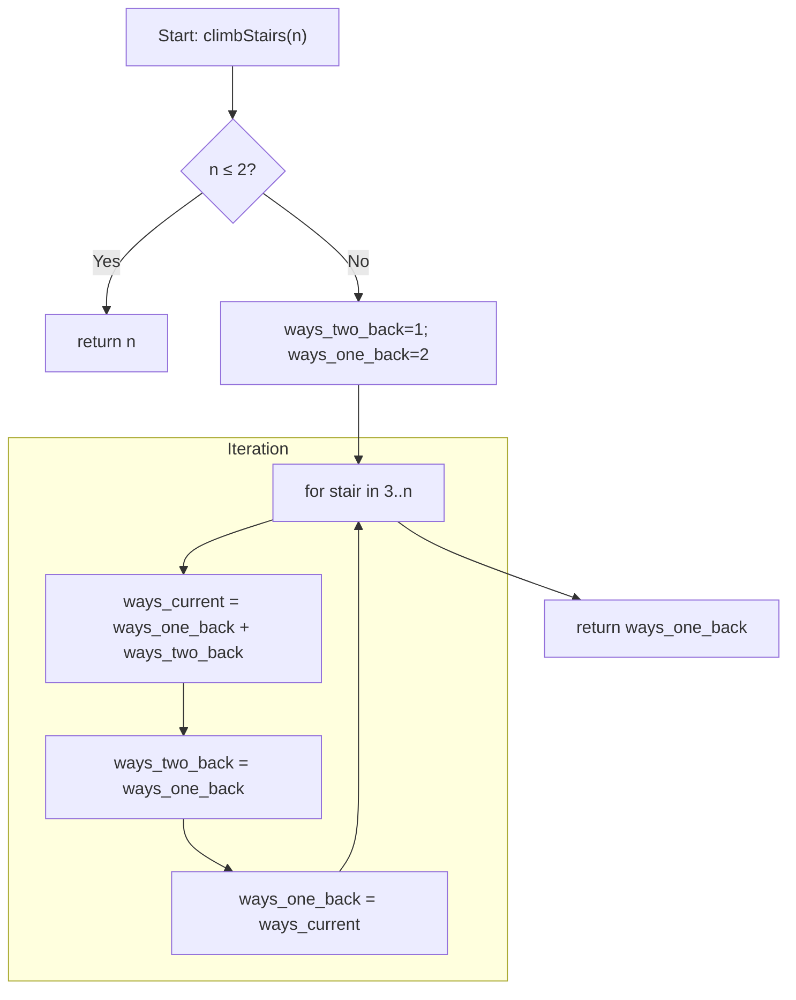

## Variables & Data Structures

- **`n: int`**  
  The target stair number (total steps).

- **`ways_two_back: int`**  
  Number of distinct ways to reach stair `i-2` in the current iteration.

- **`ways_one_back: int`**  
  Number of distinct ways to reach stair `i-1` in the current iteration.

- **`ways_current: int`**  
  Number of distinct ways to reach stair `i` in the current iteration.

## Overall Approach

This is simply the Fibonacci sequence shifted by one:

- To reach stair `i`, you can come from `i-1` with a 1-step or from `i-2` with a 2-step:
  
  ```
  ways[i] = ways[i-1] + ways[i-2]
  ```

- We only need the last two values at any time, so we use a **sliding-window** with two counters instead of an entire array.

## Step-by-Step Flowchart



1. **Handle small `n`**  
   - If `n` is 1 or 2, return `n` directly.

2. **Initialize**  
   ```python
   ways_two_back = 1    # ways to reach stair 1 (one step)
   ways_one_back = 2    # ways to reach stair 2 (1+1 or 2)
   ```

3. **Iterate** from stair 3 up to `n`:
   - Compute  
     ```python
     ways_current = ways_one_back + ways_two_back
     ```
   - Slide the window forward:  
     ```python
     ways_two_back, ways_one_back = ways_one_back, ways_current
     ```

4. **Return**  
   - After the loop, `ways_one_back` holds the number of ways to reach stair `n`.

## Complexity

- **Time:** $O(n)$ — single loop from 3 to $n$.  
- **Space:** $O(1)$ — only three integer variables regardless of $n$.
