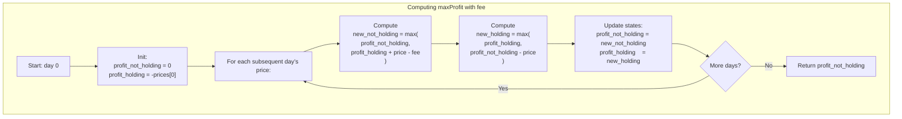

## Data Structures

**Inputs:**  
- `prices`: list of integers of length `n`, where `prices[i]` is the stock price on day _i_.  
- `fee`: integer transaction fee paid whenever you **sell** a share.

**Auxiliary Variables:**  
- `profit_not_holding`: maximum profit achievable **so far** if **you do not** hold a share at the end of the current day.  
- `profit_holding`: maximum profit achievable **so far** if **you do** hold a share at the end of the current day.

---

## What happens in `maxProfit`?

We perform a **one‑pass dynamic programming** over the days, maintaining two states (`holding` vs. `not holding`) and updating them each day based on the possible transactions.



I. **Initialization (day 0)**  
```python
profit_not_holding = 0
profit_holding     = -prices[0]   # if we buy on day 0
```

II. **Daily transitions**  
For each subsequent `price` in `prices[1:]`:

1. **Sell today (or do nothing)**  
   ```python
   new_not_holding = max(
       profit_not_holding,          # keep not holding
       profit_holding + price - fee # sell today, pay fee
   )
   ```
2. **Buy today (or do nothing)**  
   ```python
   new_holding = max(
       profit_holding,              # keep holding
       profit_not_holding - price   # buy today
   )
   ```
3. **Update**  
   ```python
   profit_not_holding, profit_holding = new_not_holding, new_holding
   ```

III. **Result**  
At the end of all days, you maximize profit by **not** holding any stock:
```python
return profit_not_holding
```

---

## Example

```python
prices = [1, 3, 2, 8, 4, 9]
fee    = 2
```

| Day | Price | not_holding | holding | Action                          |
|:---:|:-----:|:-----------:|:-------:|:--------------------------------|
|  0  |   1   |       0     |   −1    | buy at 1                        |
|  1  |   3   |   max(0, −1+3−2)=0  | max(−1, 0−3)=−1 | no transaction                 |
|  2  |   2   |   max(0, −1+2−2)=0  | max(−1, 0−2)=−2 | no transaction                 |
|  3  |   8   | max(0, −2+8−2)=4    | max(−2, 0−8)=−2 | sell at 8 (profit 4)           |
|  4  |   4   | max(4, −2+4−2)=4    | max(−2, 4−4)=0  | buy at 4                       |
|  5  |   9   | max(4, 0+9−2)=7     | max(0, 4−9)=0   | sell at 9 (profit 7)           |

**Answer:** 7


## Complexity

- **Time:**  
  - Single pass over `prices`: **O(n)**.

- **Space:**  
  - **O(1)** extra space (just two state variables and temporaries).
