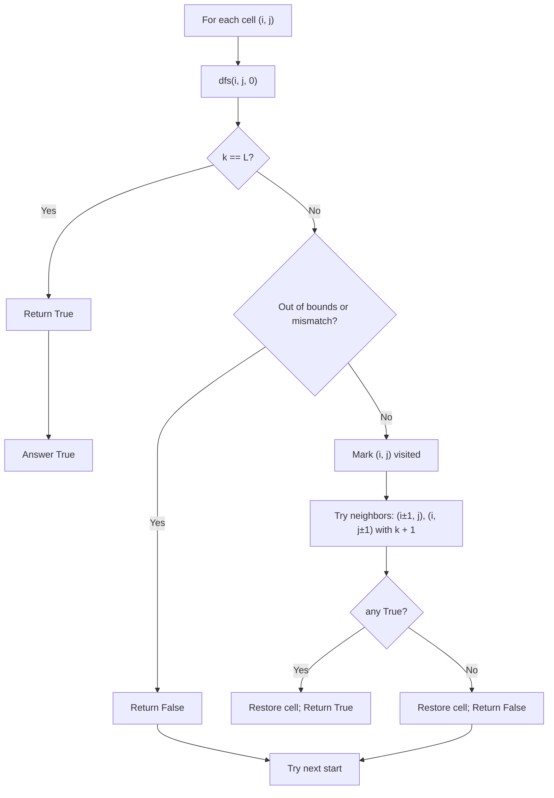

## Data Structures

**Inputs:**

* `board`: an $m \times n$ grid of characters.
* `word`: string of length $L$.

**Auxiliary variables:**

* Indices $(i,j)$: current cell in the grid.
* $k$: current position in `word` (how many characters matched so far).
* Implicit “visited” marker: temporarily overwrite `board[i][j]` during the path to prevent reuse.

## Overall Approach

Use **DFS backtracking** from every cell that could start the word.
Maintain the invariant:

$$
\text{dfs}(i,j,k) \;\Longleftrightarrow\; \exists\text{ a path from }(i,j)\text{ using unused neighbors s.t. } 
\text{board path} = \text{word}[k:].
$$

At each step:

1. **Finish check:** if $k=L$, all characters matched → **True**.
2. **Bounds & match check:** if $(i,j)$ is out of bounds or `board[i][j] ≠ word[k]`, return **False**.
3. **Choose & mark:** temporarily mark $(i,j)$ as visited.
4. **Explore:** recurse to the four orthogonal neighbors with $k+1$.
5. **Un-choose (backtrack):** restore the original character and propagate whether any branch succeeded.

If any start cell returns true, the word exists.

## Invariants & Correctness

* **No reuse:** marking enforces each cell is used at most once on the current path.
* **Prefix property:** entering `dfs(i,j,k)` implies the path so far equals `word[:k]`; the step checks `board[i][j] == word[k]`, extending the prefix by one.
* **Exhaustiveness:** from each valid state, all four admissible moves are explored; thus if a realization exists, some branch finds it.

## Complexity Analysis

Let $L = |word|$.

* **Time:** In the worst case, each of the $mn$ starts branches to up to 4 directions, then at most 3 thereafter (can’t immediately go back).

$$
O\!\left(mn \cdot 3^{L-1}\right)
$$

  (often written $O(mn\cdot 4^L)$ as a looser bound).
* **Space:** recursion depth $\le L$ → $O(L)$ stack; no extra visited array if we mutate the board (otherwise $O(L)$ or $O(mn)$ depending on representation).

## Edge Considerations

* If $L > mn$, return **False** immediately.
* Optional early pruning: frequency check—if `word` requires a character more times than it appears in `board`, it’s impossible.
