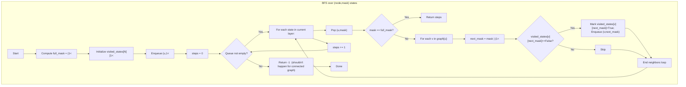

## Data Structures

**Inputs:**  
- `graph`: adjacency list of the undirected (connected) graph, where `graph[u]` is the list of neighbors of node _u_.  
- `node_count` (`N`): number of nodes (`N = len(graph)`).

**Auxiliary Variables:**

- `full_mask`: an integer bitmask with the lowest `N` bits set to 1, i.e.
  ```python
  full_mask = (1 << N) - 1
  ```
  represents “all nodes have been visited.”

- `visited_states`: a 2D boolean array of size `N × (1<<N)` where
  ```
  visited_states[u][mask] == True
  ```
  means “we have already enqueued the state (current node =u, visited‐set =mask).”

- `bfs_queue`: a deque for our multi‐source BFS, holding tuples
  ```
  (current_node, visited_mask)
  ```
  representing that we are currently at `current_node` having visited exactly the set of nodes in `visited_mask`.

- `steps`: integer counter of how many BFS layers (moves) we’ve performed so far.

---

## What happens in `shortestPathLength(graph)`

We’re looking for the shortest path (in edge‐count) that visits **every node at least once**.  By treating each `(node, visited_mask)` as a state, we run a standard BFS on this expanded state graph, starting from **all** single‐node visits simultaneously.



1. **Full‐mask**  
   ```python
   full_mask = (1 << N) - 1
   ```
   This integer has 1s in positions 0 through N−1.

2. **Visited states**  
   We track whether each `(node,mask)` pair has been enqueued, to avoid revisiting.  

3. **Multi‐source BFS initialization**  
   For every node _u_ in `0…N−1`, enqueue the state `(u, mask=1<<u)` and mark it visited.  This seeds all possible starting points in one BFS.

4. **Layered BFS**  
   We expand layer by layer (incrementing `steps` after each layer).  At each state `(u,mask)` we check:
   - If `mask == full_mask`, we’ve visited every node, so the current `steps` is the answer.
   - Otherwise, for each neighbor _v_ of _u_, compute `next_mask = mask | (1<<v)` and enqueue `(v,next_mask)` if unseen.

5. **Termination**  
   As soon as any state reaches the full‐mask, we return the current `steps`.  The connectivity guarantee ensures we’ll always find such a state.

---

## Example

```python
graph = [
  [1],    # node 0
  [0,2],  # node 1
  [1,3],  # node 2
  [2]     # node 3
]
```

- **N = 4**, so `full_mask = 0b1111 = 15`.  
- We enqueue initial states:  
  ```
  (0,0b0001), (1,0b0010), (2,0b0100), (3,0b1000)
  ```
- **Steps = 0**: none has full_mask.  
- **Steps = 1**: from each, we move one edge—states like `(1,0b0011)`, `(0,0b0011)`, `(2,0b0110)`, etc.  
- …  
- **Steps = 3**: the first time we reach any state with `mask == 0b1111` (e.g. path 0→1→2→3 starting from 0).  
- **Answer = 3**.

---

## Complexity

- **Time:**  
  - There are at most `N·2^N` distinct states.  
  - Each state explores up to `deg(u)` neighbors, so total work is O((N·2^N) + ∑deg(u)·2^N) = O(E·2^N + N·2^N).  
  - For small N (≤12–15), this is feasible; otherwise exponential.

- **Space:**  
  - O(N·2^N) for the `visited_states` table and the BFS queue in the worst case.
