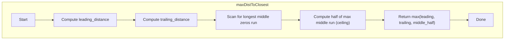

## Data Structures

**Input:**  
- `seats`: a list of integers of length `n`, where each element is either `0` (empty seat) or `1` (occupied seat).

**Auxiliary Variables:**  
- `n`: integer, the total number of seats (`n = len(seats)`).
- `first_one`: index of the first occupied seat.
- `last_one`: index of the last occupied seat.
- `leading_distance`: number of empty seats before the first `1`.
- `trailing_distance`: number of empty seats after the last `1`.
- `max_distance`: the largest stretch of consecutive zeros found between two occupied seats.
- `current_distance`: counter for the current run of zeros during the scan.

## What happens in `maxDistToClosest`?

We need to find for each empty seat the distance to the nearest occupied seat, and then return the maximum of these. There are three regions to consider:



I. **Leading zeros**  
Find the index of the first occupied seat:

```python
first_one = seats.index(1)
leading_distance = first_one
```

This is the number of empty seats before the first `1`.

II. **Trailing zeros**  

Find the index of the last occupied seat by reversing and finding the first `1`:

```python
last_one = n - 1 - seats[::-1].index(1)
trailing_distance = (n - 1) - last_one
```

This counts the empty seats after the final `1`.

III. **Middle zeros**  

Scan through `seats`, tracking runs of `0`s between `1`s:

```python
max_distance = 0
current_distance = 0
for s in seats:
    if s == 1:
        max_distance = max(max_distance, current_distance)
        current_distance = 0
    else:
        current_distance += 1
```
After the loop, `max_distance` is the length of the largest block of zeros between two occupied seats. The optimal seat in the middle of such a block is at its center, giving a distance of `ceil(max_distance / 2)`.

IV. **Result**  

Return the maximum among the three candidates:

```python
return max(
    leading_distance,
    trailing_distance,
    math.ceil(max_distance / 2)
)
```

## Example

```python
seats = [1, 0, 0, 0, 1, 0, 1]
# n = 7
```

1. **Leading zeros**:  
- `first_one = 0` → `leading_distance = 0`

2. **Trailing zeros**:  
- `last_one = 6` → `trailing_distance = 0`

3. **Middle zeros**:  
- Scan runs:  
 - Between index 0 and 4: run of length 3 (`[0,0,0]`)  
 - Between index 4 and 6: run of length 1 (`[0]`)  
- `max_distance = 3` → middle candidate distance = `ceil(3/2) = 2`

4. **Answer**:

```python
return max(0, 0, 2)  # = 2
```

The best seat is in the middle of the first gap (at index 2), giving a distance of 2 to the closest person.

## Complexity

**Time:**  

- Finding `first_one` and `last_one`: each `O(n)` in the worst case.  
- Single pass to compute `max_distance`: `O(n)`.  
- Overall: **O(n)**.

**Space:**

- **O(1)** extra space (all counters and indices).
