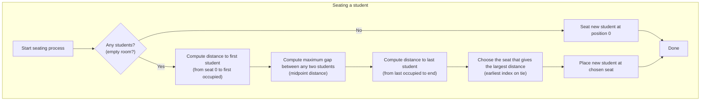
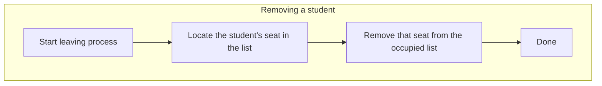

## Data Structures

**`self.total_seats`**  
An integer `n`, the number of seats indexed from `0` to `n‑1`.

**`self.occupied`**  

- Instead of tracking all the seats, we just track the **occupied** seats.
- A **sorted list** of integers, each is an index of a seat that’s currently taken.
- We keep it sorted so that we can quickly scan adjacent occupied seats to find gaps, and remove a leaving student in O(log k + k) time (with `bisect`).

## What happens in seat()?

When a new student arrives, we want to pick the seat that **maximizes** the distance to the closest occupied seat. Ties go to the **lowest** index.



I. **Empty room**  

```python
if not occupied:
   occupied.append(0)
   return 0
```

No one’s here: sit at seat `0`.

II. **Left‐edge candidate**  

The first student is at `occupied[0]`.  

- Sitting at seat `0` would give a distance of `occupied[0] − 0`.  
- Initialize:

```python
chosen_seat = 0
max_dist    = occupied[0]
```

III. **Middle gaps**  

Scan through each pair of adjacent occupied seats, say `(prev, next)`.  

- The optimal spot between them is the midpoint  

```
candidate = prev + floor((next − prev) / 2)
```

- Distance to closest neighbor is `floor((next − prev) / 2)`.  
- If that exceeds our current `max_dist`, pick it.

Suppose `occupied = [2, 9]`. Seats look like:

```
Index:  0 1 2 3 4 5 6 7 8 9
        . . X . . . . . . X
```

The gap between 2 and 9 is length 6 (seats 3–8). The best seat is at

```
prev = 2, next = 9
mid  = 2 + (9−2)//2 = 2 + 3 = 5
```

giving distance 3 from either side.

IV. **Right‐edge candidate**  

After scanning all interior gaps, also consider sitting at the very last seat, `n−1`, which gives distance

```
end_dist = (n−1) − occupied[-1]
```

If that beats `max_dist`, choose it.

V. **Insert and return**  

Once `chosen_seat` is decided, we do

```python
bisect.insort(self.occupied, chosen_seat)
return chosen_seat
```

## What happens in leave(p)?



When a student at seat `p` leaves:

I. **Locate** `p` in the sorted list via binary search:

```python
idx = bisect.bisect_left(self.occupied, p)
```

II. **Remove** it with `.pop(idx)`.

This keeps `self.occupied` always sorted.

## Example

Let’s run through the sample from the problem statement:

```
n = 10 seats, initially occupied = []
```

I. **First seat()** → sits at 0  

```
occupied = [0]
```

Current State:

```
Index:  0 1 2 3 4 5 6 7 8 9
        X . . . . . . . . .
```

II. **Second seat()**  

- Left‐edge: dist = 0  
- No middle gaps  
- Right‐edge: dist = 9−0 = 9 → best  

```
occupied = [0, 9]
```

Current State:

```
Index:  0 1 2 3 4 5 6 7 8 9
        X . . . . . . . . X
```

III. **Third seat()**  

- Left‐edge: dist = 0  
- Gaps: (0,9) → mid = 4, dist = 4 → best so far  
- Right‐edge: dist = 0  

```
occupied = [0, 4, 9]
```

Current State:

```
Index:  0 1 2 3 4 5 6 7 8 9
        X . . . X . . . . X
```

IV. **Fourth seat()**  

- Left‐edge: dist = 0  
- Gaps:  
 - (0,4) → mid = 2, dist = 2  
 - (4,9) → mid = 6, dist = 2  
- Right‐edge: dist = 0  

Tie on dist=2 → pick lower index → seat 2  

```
occupied = [0, 2, 4, 9]
```

Current State:

```
Index:  0 1 2 3 4 5 6 7 8 9
        X . X . X . . . . X
```

V. **leave(4)**  

```
occupied = [0, 2, 9]
```

Current State:

```
Index:  0 1 2 3 4 5 6 7 8 9
        X . X . . . . . . X
```

VI. **seat()** again  

- Left‐edge: dist = 0  
- Gaps:  
 - (0,2) → mid=1, dist=1  
 - (2,9) → mid=5, dist=3 → best  
- Right‐edge: dist = 0  

```
chosen = 5
occupied = [0, 2, 5, 9]
```

Current State:

```
Index:  0 1 2 3 4 5 6 7 8 9
        X . X . . X . . . X
```

## Complexity

- `seat()` runs in $O(k)$ time, where $k$ is the current number of students, because we do one linear scan of `self.occupied` ($k \le 10^4$).  
- `leave()` uses binary search plus list removal $\to O(\log k + k)$, also fine for $k \le 10^4$.  
- Space is $O(k)$, never $O(n)$, so it handles $n$ up to $10^9$ effortlessly.
