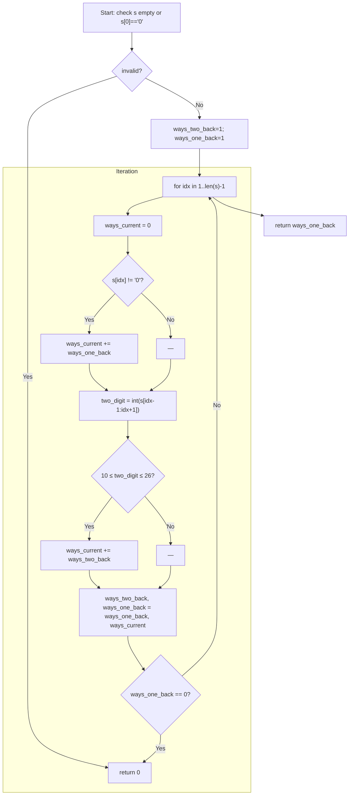

## Data Structures

- **`s: str`**  
  The input string of digits to decode.

- **`ways_two_back: int`**  
  Corresponds to `dp[i-2]` — the number of ways to decode the prefix ending two positions before the current index.

- **`ways_one_back: int`**  
  Corresponds to `dp[i-1]` — the number of ways to decode the prefix ending at the previous index.

- **`ways_current: int`**  
  Corresponds to `dp[i]` — the number of ways to decode the prefix ending at the current index.

- **`two_digit: int`**  
  The integer value of the substring `s[idx-1:idx+1]`, used to check if a valid two-digit decode (10–26) exists.

## Overall Approach

We use a **sliding-window DP** that only keeps the last two DP values (`dp[i-2]` and `dp[i-1]`) instead of an entire array:

1. **Initialization**  
   ```python
   # Empty string or leading '0' → no decodings
   if not s or s[0] == '0':
       return 0

   # dp[0] = 1  (empty prefix)
   # dp[1] = 1  (first char is non-zero)
   ways_two_back, ways_one_back = 1, 1
   ```

2. **Iterate through each character** (from `idx = 1` to `len(s)-1`):
   - **Reset** `ways_current = 0`.
   - **Single-digit check:**  
     If `s[idx] != '0'`, then the digit at `idx` can stand alone.  
     ```python
     ways_current += ways_one_back
     ```
   - **Two-digit check:**  
     Parse  
     ```python
     two_digit = int(s[idx-1:idx+1])
     ```  
     If `10 ≤ two_digit ≤ 26`, then the pair can decode to one letter.  
     ```python
     ways_current += ways_two_back
     ```
   - **Slide window:**  
     Shift the DP window forward:
     ```python
     ways_two_back, ways_one_back = ways_one_back, ways_current
     ```
   - **Early exit:**  
     If `ways_one_back == 0`, no valid decodings remain for any extension → return `0`.

3. **Final answer**  
   After the loop, `ways_one_back` equals `dp[n]`, the number of ways to decode the entire string → return it.

## Step-By-Step Flowchart



## Complexity

- **Time:** $O(n)$  
  A single pass over the string of length $n$, with only constant-time operations per character.

- **Space:** $O(1)$  
  Only three integer variables (`ways_two_back`, `ways_one_back`, `ways_current`) and a small constant amount of additional space.
