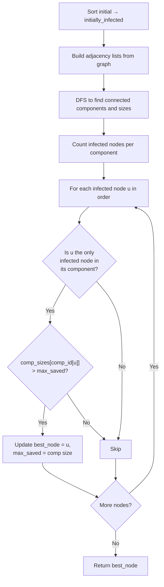

## Data Structures

**Inputs:**

* `graph`: $n \times n$ adjacency matrix where `graph[i][j] = 1` means nodes $i$ and $j$ are connected.
* `initial`: list of initially infected node indices.

**Auxiliary Variables:**

* `adj_lists`: adjacency list representation built from `graph`, where `adj_lists[i]` is a list of neighbors of node $i$.
* `comp_id`: array of length $n$ mapping each node to its connected component ID (`-1` = unvisited).
* `comp_sizes`: list where `comp_sizes[k]` is the number of nodes in component $k$.
* `infected_count_per_comp`: list counting how many initially infected nodes belong to each component.
* `stack`: list used as a DFS stack during component discovery.

## Overall Approach

Malware spreads through all nodes in a connected component. Removing an infected node only helps if it is the **sole** infected node in its component — otherwise, another infected node in that component will still spread the malware. Among all such "sole" infected nodes, we pick the one whose component is largest (saving the most nodes). Ties go to the smallest index.



### I. Build Adjacency Lists

Convert the $n \times n$ matrix into adjacency lists for efficient traversal:

```python
adj_lists = [
    [j for j, connected in enumerate(row) if connected == 1]
    for row in graph
]
```

### II. Find Connected Components via DFS

Iterate over all nodes. For each unvisited node, run an iterative DFS using a stack to discover all nodes in the component, recording each node's component ID and the component's size:

```python
for node in range(n):
    if comp_id[node] == -1:
        stack = [node]
        comp_id[node] = current_id
        size = 0
        while stack:
            u = stack.pop()
            size += 1
            for v in adj_lists[u]:
                if comp_id[v] == -1:
                    comp_id[v] = current_id
                    stack.append(v)
        comp_sizes.append(size)
        current_id += 1
```

### III. Count Infected Nodes per Component

For each initially infected node, increment a counter for its component. This tells us whether a component has exactly one or multiple infected sources:

```python
infected_count_per_comp = [0] * len(comp_sizes)
for u in initially_infected:
    infected_count_per_comp[comp_id[u]] += 1
```

### IV. Select the Best Node to Remove

Iterate through the sorted infected list. If a node is the **sole** infection in its component, removing it saves that entire component. Track the node that saves the most nodes:

```python
for u in initially_infected:
    cid = comp_id[u]
    if infected_count_per_comp[cid] == 1:
        saved = comp_sizes[cid]
        if saved > max_saved:
            max_saved = saved
            best_node = u
```

If no node is the unique infection in its component, the default `best_node` is `initially_infected[0]` (the smallest index, since the list was sorted).

## Complexity

* **Time:**
  Building adjacency lists scans the full $n \times n$ matrix. DFS visits every node and edge once. The infected-node loops are $O(|\text{initial}|)$. Total:

  $$O(n^2)$$

* **Space:**
  Adjacency lists store up to $O(n^2)$ edges. Component arrays and the DFS stack are $O(n)$. Total:

  $$O(n^2)$$

## Key Insights

* Malware spreads to every node in a connected component, so the problem reduces to reasoning about components rather than individual edges.
* Removing a node only reduces the final infection count when that node is the **only** infected node in its component — otherwise the component gets fully infected regardless.
* Sorting `initial` at the start guarantees that when multiple nodes tie on saved count, the smallest index is chosen first naturally.
