## Data Structures

**Inputs:**  
- `graph`: an **adjacency matrix** of size `n×n`, where `graph[i][j] = 1` if there’s an edge between node _i_ and node _j_, else 0.  
- `initial`: list of initially infected node indices.

**Auxiliary Structures:**  
- `n`: integer, number of nodes (`n = len(graph)`).  
- `adj`: adjacency list of length `n`, where  
  ```python
  adj[i] = [ j for j in range(n) if graph[i][j] ]
  ```  
  for fast neighbor iteration.  
- `best_node`: integer, the index of the node whose removal yields the smallest final infection; initialized to `min(initial)` to break ties by smallest index.  
- `min_infected`: integer, tracks the smallest number of infected nodes seen so far after simulating each removal; initialized to infinity.  
- `visited`: Boolean list of length `n`, marking which nodes are “already removed or infected” in a simulation.  
- `q`: a deque used for BFS of the infection spread.  

---

## What happens in `minMalwareSpread(graph, initial)`?

We try **removing** each initially infected node in turn (in ascending order to break ties), then simulate the spread of malware via BFS from the remaining infected seeds and count how many nodes end up infected. We pick the removal that minimizes this count.

```mermaid
flowchart TD
  subgraph minimize["Finding best node to remove"]
    A["Start"] --> B["n = len(graph)"]
    B --> C["Build adj list from graph"]
    C --> D["best_node = min(initial)\nmin_infected = ∞"]
    D --> E["For each remove_node in sorted(initial):"]
    E --> F["  Initialize visited = [False]*n"]
    F --> G["  visited[remove_node] = True  (simulate removal)"]
    G --> H["  Initialize BFS queue with other initial nodes"]
    H --> I["  visited[src] = True; enqueue src"]
    I --> J["  infected_count = 0"]
    J --> K["  While queue not empty:"]
    K --> L["    u = pop(); infected_count += 1"]
    L --> M["    For each w in adj[u]:"]
    M --> N["      If not visited[w]: visited[w]=True; enqueue w"]
    N --> O["  After BFS, compare infected_count"]
    O --> P["  If infected_count < min_infected:\n    min_infected = infected_count\n    best_node = remove_node"]
    P --> Q{"More remove_node?"}
    Q -->|Yes| E
    Q -->|No| R["Return best_node"]
    R --> S["Done"]
  end
```



### Step-by-step

1. **Build adjacency list**  
   ```python
   adj = [[j for j in range(n) if graph[i][j]] for i in range(n)]
   ```
2. **Initialize best tracking**  
   ```python
   best_node    = min(initial)
   min_infected = float('inf')
   ```
3. **Simulate removal and spread**  
   For each `remove_node` in `sorted(initial)`:  
   - **Simulate removal** by marking `visited[remove_node] = True`.  
   - **Seed BFS** with the other initially infected nodes: mark each as visited and enqueue it.  
   - **BFS**: repeatedly pop a node `u`, increment `infected_count`, and for each neighbor `w` not yet visited, mark visited and enqueue.  
4. **Update best**  
   After BFS, if this `infected_count` is strictly less than `min_infected`, update both `min_infected` and `best_node = remove_node`.  
5. **Return**  
   Once all candidates are tried, return the `best_node` that minimizes the spread; ties break in favor of the smaller index.

---

## Example

```python
graph = [
  [1,1,0],
  [1,1,0],
  [0,0,1]
]
initial = [0,1]
```

- Removing **0**:  
  - Seeds = [1], BFS from 1 visits only node 1. → `infected_count = 1`.  
- Removing **1**:  
  - Seeds = [0], BFS from 0 visits only node 0. → `infected_count = 1`.  
- Both yield the same count, so we pick the smaller index: **0**.

---

## Complexity

- **Time:**  
  - Building `adj`: O(n²).  
  - For each of up to |initial| ≤ n candidates, we run a BFS that visits each edge once: O(n + E).  
  - **Overall:** O(n² + |initial|·(n + E)) which in dense graphs is O(n³), but in practice often O(n·(n+E)).  

- **Space:**  
  - O(n²) for the adjacency list in the worst case.  
  - O(n) for `visited` and the BFS queue.
