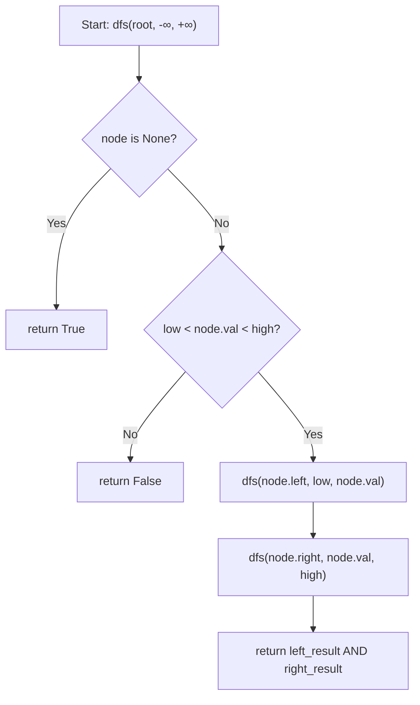

## Data Structures

**Inputs:**

* **`root: Optional[TreeNode]`**: root of the binary tree to validate.

**Auxiliary Variables:**

* **`low`**: exclusive lower bound for the current node's value, initialized to $-\infty$.
* **`high`**: exclusive upper bound for the current node's value, initialized to $\infty$.

## Overall Approach

We perform a **top-down DFS**, threading an allowed value range $(low, high)$ through every recursive call. At each node we check whether its value falls strictly between the bounds. When we recurse left, the current node's value becomes the new upper bound; when we recurse right, it becomes the new lower bound. If every node satisfies its constraint the tree is a valid BST.



## Step-by-Step Walkthrough

1. **Entry point — seed the range with infinity**

    ```python
    return dfs(root, -inf, inf)
    ```

    The root has no constraints from a parent, so the initial window is $(-\infty, +\infty)$.

2. **Base case — null node**

    ```python
    if node is None:
        return True
    ```

    An empty subtree cannot violate the BST property.

3. **Range check**

    ```python
    if not (low < node.val < high):
        return False
    ```

    If the node's value is not strictly between `low` and `high`, the tree is invalid. Strict inequality handles the constraint that BST nodes must have unique values per path (no duplicates allowed).

4. **Recurse into children with tightened bounds**

    ```python
    return dfs(node.left, low, node.val) and dfs(node.right, node.val, high)
    ```

    * **Left child**: its value must be less than the current node, so `high` is narrowed to `node.val`.
    * **Right child**: its value must be greater than the current node, so `low` is narrowed to `node.val`.

    Short-circuit evaluation via `and` skips the right subtree if the left already fails.

## Example

```
        5
       / \
      1   7
         / \
        4   8
```

| Call | node | low | high | Result |
|:-----|:----:|:---:|:----:|:------:|
| `dfs(5, -∞, +∞)` | 5 | $-\infty$ | $+\infty$ | recurse |
| `dfs(1, -∞, 5)` | 1 | $-\infty$ | 5 | `True` (leaf) |
| `dfs(7, 5, +∞)` | 7 | 5 | $+\infty$ | recurse |
| `dfs(4, 5, 7)` | 4 | 5 | 7 | **`False`** — $4 \not> 5$ |

Node 4 sits in the right subtree of 5 but has value $4 < 5$, violating the BST property. The function returns `False`.

## Complexity

* **Time:** $O(n)$

    Each node is visited exactly once. The work per node is $O(1)$ (a single comparison and two recursive calls).

* **Space:** $O(h)$

    The recursion stack grows to the height of the tree $h$. In the worst case (skewed tree) $h = n$, giving $O(n)$. For a balanced tree, $h = \log n$.
