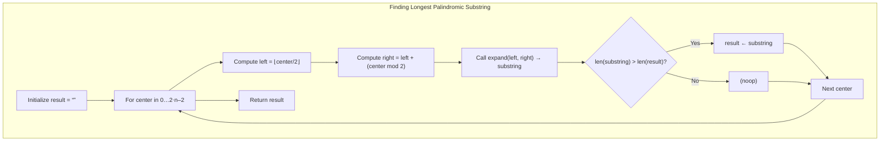

## Data Structures

**`s`**

* The input string in which we seek the longest palindromic substring.

**`n`**

* Integer length of `s`: `n = len(s)`.

**`result`**

* String accumulator holding the longest palindrome found so far.

**`left`, `right`**

* Pointers used by the helper `expand()` to grow around a candidate center.

**`_result`**

* Local string inside `expand()` that builds and returns the palindrome centered at `(left, right)`.

---

## High-Level Overview

This algorithm examines every possible palindrome center (character or between characters), expands outward to build the maximal palindrome at that center, and tracks the longest one seen.



---

## Detailed Steps

1. **Initialize**

   ```python
   n = len(s)
   result = ""
   ```

   * `n` stores the string length.
   * `result` starts empty.

2. **Define `expand(left, right)`**

   ```python
   def expand(left, right):
       if left == right:
           _result = s[left]             # odd-length center
       else:
           if s[left] != s[right]:
               return ""                # not a palindrome
           _result = s[left] + s[right] # even-length base

       left -= 1
       right += 1

       while left >= 0 and right < n and s[left] == s[right]:
           _result = s[left] + _result + s[right]
           left -= 1
           right += 1

       return _result
   ```

   * **Odd-length palindromes** start with a single character (`left == right`).
   * **Even-length palindromes** start with a two‐character match; otherwise return `""`.
   * Expand outward while characters match, building `_result`.

3. **Iterate all centers**

   ```python
   for center in range(2*n - 1):
       left  = center // 2
       right = left + (center % 2)
       substring = expand(left, right)
       if len(substring) > len(result):
           result = substring
   ```

   * `2n–1` possible centers cover both odd/even palindromes.
   * Update `result` whenever a longer palindrome is found.

4. **Return the longest palindrome**

   ```python
   return result
   ```

---

## Complexity

* **Time:**
  There are $2n-1$ centers, and each expansion may extend up to $\min(left+1, n-right)$ steps. In the worst case, this is $O(n)$ per center, yielding

  $$
    O\bigl(n \times n\bigr) \;=\; O(n^2).
  $$

* **Space:**

  * $O(1)$ extra space for pointers and accumulators (ignoring the input and the space for the returned substring).
